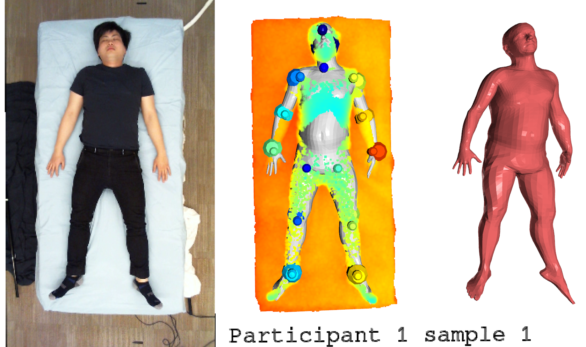

# SMPL fits to the SLP dataset

#### Installation

Note, due to the Open3D dependency, Python 3.6 - 3.8 must be used.

1. Clone the repository
2. Install dependencies `pip install -r requirements.txt`
3. Register and download the [SMPL model](https://smpl.is.tue.mpg.de/). Extract the male and female pkl files, then rename and copy to `models/smpl/SMPL_MALE.pkl` and `models/smpl/SMPL_FEMALE.pkl`

#### View Fits

A visualizer is included in this repo. Press Q to advance to the next sample.
```
python view_fits.py
```

